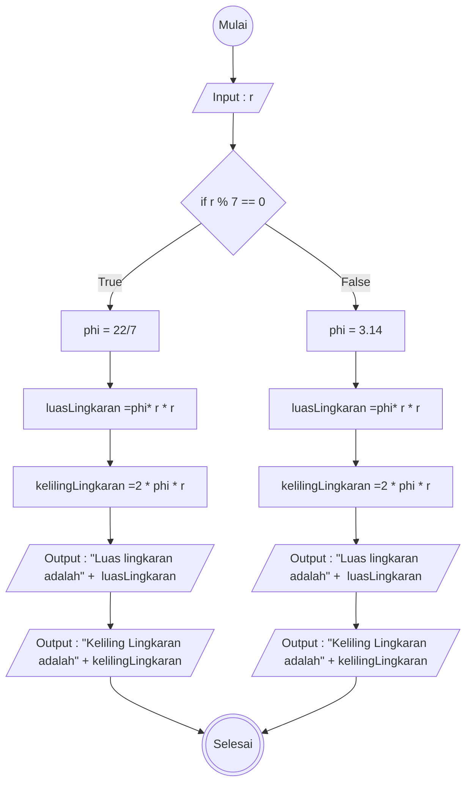

# Algoritma Javascript1

## Task1

```mermaid
flowchart TD
A@{ shape: circle, label: "Mulai" }
B@{ shape: lean-r, label: "Input : r" }
C@{ shape: diamond, label: "if r % 7 == 0" }
D@{ shape: rect, label: "phi = 22/7" }
E@{ shape: rect, label: "phi = 3.14" }
F@{ shape: rect, label: "luasLingkaran =phi* r * r" }
G@{ shape: lean-r, label: 'Output : "Luas lingkaran adalah" +  luasLingkaran' }
H@{ shape: rect, label: "kelilingLingkaran =2 * phi * r" }
I@{ shape: lean-r, label: 'Output : "Keliling Lingkaran adalah" + kelilingLingkaran' }
J@{ shape: dbl-circ, label: "Selesai" }
K@{ shape: rect, label: "luasLingkaran =phi* r * r" }
L@{ shape: rect, label: "kelilingLingkaran =2 * phi * r" }
M@{ shape: lean-r, label: 'Output : "Luas lingkaran adalah" +  luasLingkaran' }
N@{ shape: lean-r, label: 'Output : "Keliling Lingkaran adalah" + kelilingLingkaran' }

A-->B-->
C--True-->D
C--False-->E
D-->F-->H-->G-->I-->J
E-->K-->L-->M-->N-->J


```