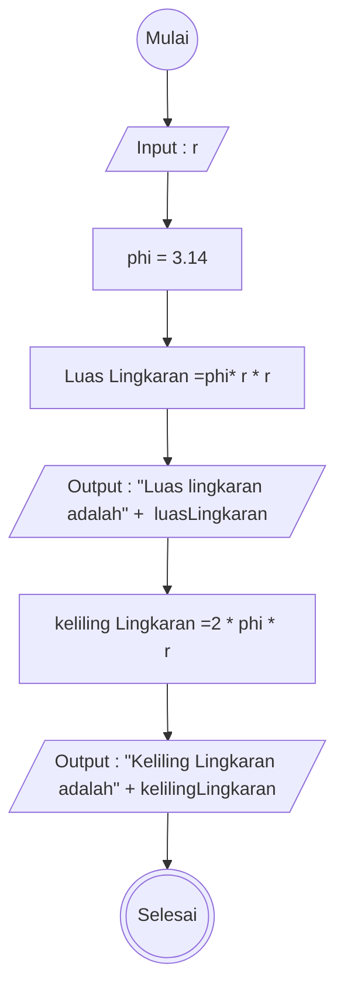

# Algoritma Javascript1

## Task1

```mermaid
flowchart TD
A@{ shape: circle, label: "Mulai" }
B@{ shape: lean-r, label: "Input : r" }
C@{ shape: rect, label: "phi = 3.14" }
D@{ shape: rect, label: "Luas Lingkaran =phi* r * r" }
E@{ shape: lean-r, label: 'Output : "Luas lingkaran adalah" +  luasLingkaran' }
F@{ shape: rect, label: "keliling Lingkaran =2 * phi * r" }
G@{ shape: lean-r, label: 'Output : "Keliling Lingkaran adalah" + kelilingLingkaran' }
H@{ shape: dbl-circ, label: "Selesai" }

A-->B-->C-->D-->E-->F-->G-->H


```