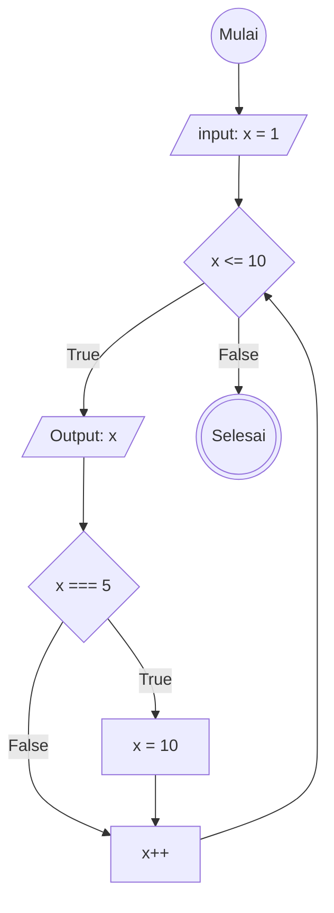
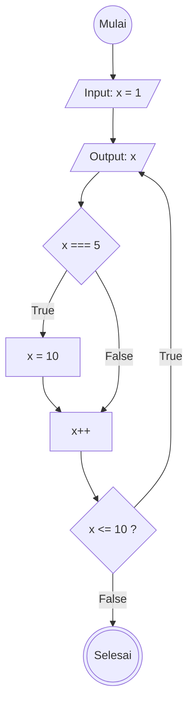

# Flowchart Loop

## Flowchart for-loop

```mermaid
flowchart TD
A@{ shape: circle, label: "Mulai" }
B@{ shape: lean-r, label: 'input: x = 1' }
C@{ shape: diamond, label: "x <= 10" }
D@{ shape: lean-r, label: "Output: x" }
E@{ shape: diamond, label: "x === 5" }
F@{ shape: rectangle, label: "x = 10" }
G@{ shape: rectangle, label: "x++" }
H@{ shape: dbl-circ, label: "Selesai" }

A --> B --> C
C -- True --> D --> E
E -- False --> G --> C
E -- True --> F --> G
C -- False --> H

```

## Flowchart for-loop

let x = 1;
do {
    console.log(x);
    if (x === 5) {
        x = 10;
    }
    x++;
} while (x <= 10);

```mermaid
flowchart TD
A@{ shape: circle, label: "Mulai" }
B@{ shape: lean-r, label: "Input: x = 1" }
D@{ shape: lean-r, label: "Output: x" }
E@{ shape: diamond, label: "x === 5" }
F@{ shape: rectangle, label: "x = 10" }
G@{ shape: rectangle, label: "x++" }
C@{ shape: diamond, label: "x <= 10 ?" }
H@{ shape: dbl-circ, label: "Selesai" }

A --> B --> D
D --> E
E -- True --> F --> G --> C
E -- False --> G 
C -- True --> D
C -- False --> H

```
