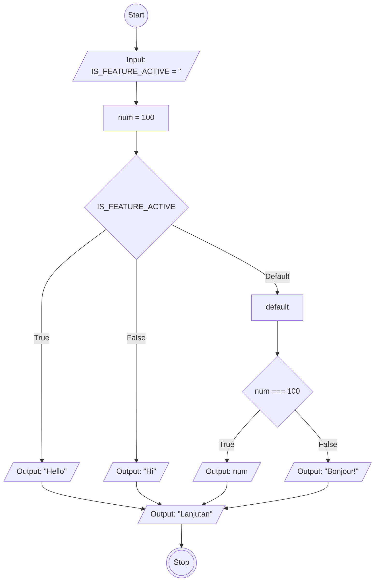

```mermaid
flowchart TD
A@{ shape: circle, label: "Start" }
B@{ shape: lean-r, label: "Input:
    IS_FEATURE_ACTIVE = ''" }
L@{ shape: rect, label: "num = 100" }
C@{ shape: diamond, label: "IS_FEATURE_ACTIVE" }
D@{ shape: lean-r, label: 'Output: "Hello"' }
E@{ shape: lean-r, label: 'Output: "Hi"' }
F@{ shape: rect, label: "default" }
G@{ shape: diamond, label: "num === 100" }
H@{ shape: lean-r, label: "Output: num" }
I@{ shape: lean-r, label: 'Output: "Bonjour!"' }
J@{ shape: lean-r, label: 'Output: "Lanjutan"' }
K@{ shape: dbl-circ, label: "Stop" }
A --> B --> L --> C
C --True--> D
C --False--> E
C --Default--> F
F --> G
G --True--> H
G --False--> I
D --> J
E --> J
H --> J
I --> J
J --> K

```