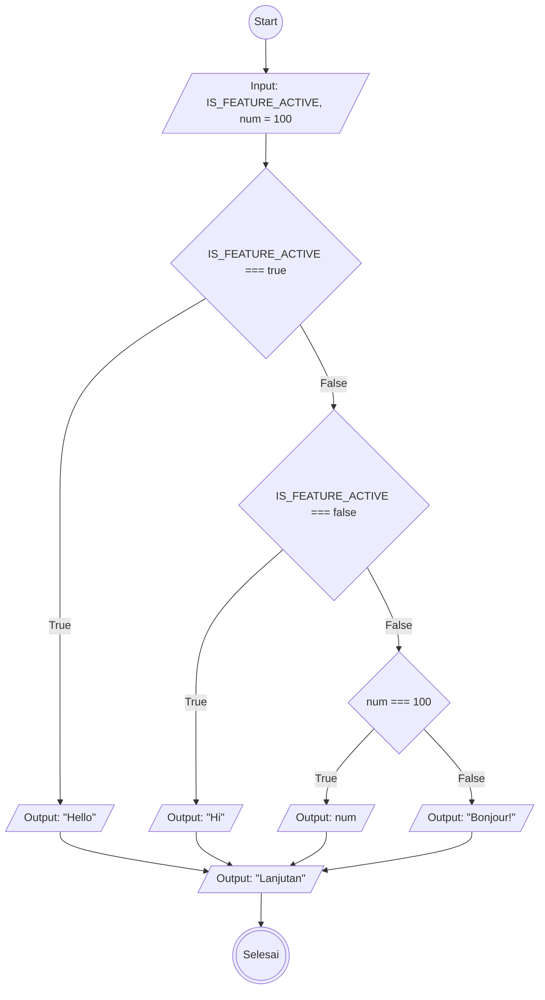

# Flowchart switch

## flowchart

```mermaid
flowchart TD
A@{ shape: circle, label: "Start" }
B@{ shape: lean-r, label: 'Input: IS_FEATURE_ACTIVE, num = 100' }
C@{ shape: diamond, label: "IS_FEATURE_ACTIVE === true" }
D@{ shape: lean-r, label: 'Output: "Hello"' }
E@{ shape: diamond, label: "IS_FEATURE_ACTIVE === false" }
F@{ shape: lean-r, label: 'Output: "Hi"' }
G@{ shape: diamond, label: "num === 100" }
H@{ shape: lean-r, label: "Output: num" }
I@{ shape: lean-r, label: 'Output: "Bonjour!"' }
J@{ shape: lean-r, label: 'Output: "Lanjutan"' }
K@{ shape: dbl-circ, label: "Selesai" }

A --> B
B --> C
C -- True --> D --> J
C -- False --> E
E -- True --> F --> J
E -- False --> G
G -- True --> H --> J
G -- False --> I --> J
J --> K


```