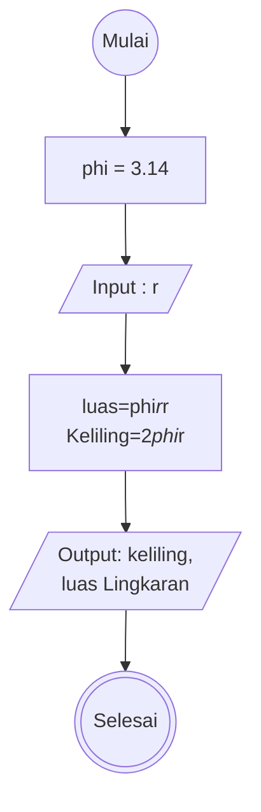

# Algoritma Javascript1

## Task1

```mermaid
flowchart TD
A@{ shape: circle, label: "Mulai" }
B@{ shape: rect, label: "phi = 3.14" }
C@{ shape: lean-r, label: "Input : r" }
D@{ shape: rect, label: "luas=phi*r*r
Keliling=2*phi*r" }
E@{ shape: lean-r, label: "Output: keliling,
luas Lingkaran" }
F@{ shape: dbl-circ, label: "Selesai" }
A-->B-->C-->D-->E-->F


```