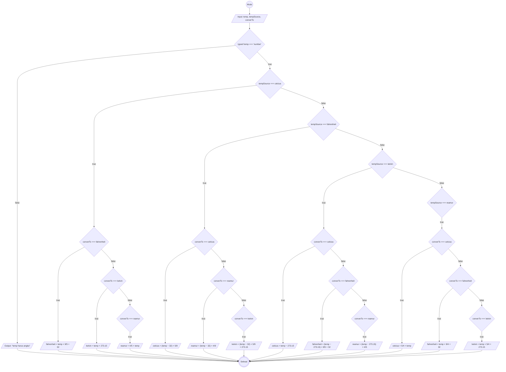

# Flowchart conversi Suhu

```mermaid
flowchart TD
A@{ shape: circle, label: "Mulai" }
B@{ shape: lean-r, label: "Input: temp, tempSource, converTo" }
C@{ shape: diamond, label: "typeof temp === 'number'" }
D@{ shape: lean-r, label: 'Output: "temp harus angka"' }
E@{ shape: diamond, label: "tempSource === celcius" }
%% CELCIUS
F@{ shape: diamond, label: "converTo === fahrenheit" }
G@{ shape: lean-r, label: "fahrenheit = temp × 9/5 + 32" }
H@{ shape: diamond, label: "converTo === kelvin" }
I@{ shape: lean-r, label: "kelvin = temp + 273.15" }
J@{ shape: diamond, label: "converTo === reamur" }
K@{ shape: lean-r, label: "reamur = 4/5 × temp" }
%% FAHRENHEIT
L@{ shape: diamond, label: "tempSource === fahrenheit" }
M@{ shape: diamond, label: "converTo === celcius" }
N@{ shape: lean-r, label: "celcius = (temp − 32) × 5/9" }
O@{ shape: diamond, label: "converTo === reamur" }
P@{ shape: lean-r, label: "reamur = (temp − 32) × 4/9" }
Q@{ shape: diamond, label: "converTo === kelvin" }
R@{ shape: lean-r, label: "kelvin = (temp − 32) × 5/9 + 273.15" }
%% KELVIN
S@{ shape: diamond, label: "tempSource === kelvin" }
T@{ shape: diamond, label: "converTo === celcius" }
U@{ shape: lean-r, label: "celcius = temp − 273.15" }
V@{ shape: diamond, label: "converTo === fahrenheit" }
W@{ shape: lean-r, label: "fahrenheit = (temp − 273.15) × 9/5 + 32" }
X@{ shape: diamond, label: "converTo === reamur" }
Y@{ shape: lean-r, label: "reamur = (temp − 273.15) × 4/5" }
%% REAMUR
Z@{ shape: diamond, label: "tempSource === reamur" }
AA@{ shape: diamond, label: "converTo === celcius" }
AB@{ shape: lean-r, label: "celcius = 5/4 × temp" }
AC@{ shape: diamond, label: "converTo === fahrenheit" }
AD@{ shape: lean-r, label: "fahrenheit = temp × 9/4 + 32" }
AE@{ shape: diamond, label: "converTo === kelvin" }
AF@{ shape: lean-r, label: "kelvin = temp × 5/4 + 273.15" }
END@{ shape: dbl-circ, label: "Selesai" }


A --> B --> C
C -- false --> D --> END
C -- true --> E
E -- true --> F
E -- false --> L
F -- true --> G --> END
F -- false --> H
H -- true --> I --> END
H -- false --> J
J -- true --> K --> END
L -- true --> M
L -- false --> S
M -- true --> N --> END
M -- false --> O
O -- true --> P --> END
O -- false --> Q
Q -- true --> R --> END
S -- true --> T
S -- false --> Z
T -- true --> U --> END
T -- false --> V
V -- true --> W --> END
V -- false --> X
X -- true --> Y --> END
Z -- true --> AA
AA -- true --> AB --> END
AA -- false --> AC
AC -- true --> AD --> END
AC -- false --> AE
AE -- true --> AF --> END


```